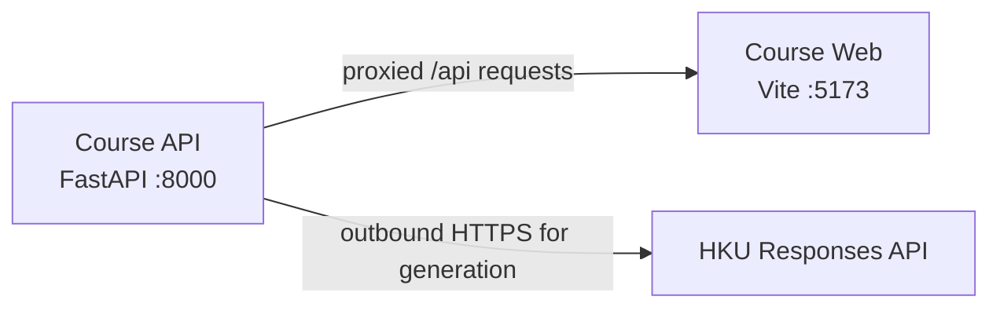

# Azure Debug Plan

> This plan is the source of truth for generating the
> VS Code debug setup in this workspace.
>
> **Status:** Implemented
> **Execution Mode:** Guided
> **Created:** 2026-09-23T05:03:20Z
> **Last Updated:** 2026-09-23T05:19:36Z
>
> <!-- Guided Mode (default) - hand-holds the user through review and approval before generating. -->
> <!-- Auto Mode (aka YOLO mode) — skips approval gates and runs generation unattended. -->

---

## Prerequisites

| Tool / Extension | Category | Service(s) | Installed | Version |
|------------------|----------|------------|-----------|---------|
| Python | Runtime | course-api | ✅ | 3.14.4 |
| pip | Package manager | course-api | ✅ | 26.0.1 |
| Node.js | Runtime | course-web | ✅ | 24.19.0 |
| npm | Package manager | course-web | ✅ | 11.17.0 |
| Chrome | Browser | course-web | ✅ | 153.0.8010.53 |
| Docker | Container runtime (optional) | course-api, course-web | ❓ | — |
| Docker Compose | Compose provider (optional) | course-api, course-web | ❓ | — |

> ⚠️ **Action required:** Docker and Docker Compose could not be confirmed by direct or initialized-shell checks. They are optional for host-based debugging; verify them only if you plan to use the existing `compose.yaml` launcher.

---

## Debug Configurations

Each checked row below produces a VS Code debug configuration in `.vscode/launch.json`.

| Generate | Debug Config Name | Service Label | Service Root | Project Type | Runtime | Version | Azure Dependencies |
|----------|--------------------|---------------|--------------|--------------|---------|---------|---------------------|
| [x] | Course API (debug) | Course API | `./services/course-api` | app-service | python | 3.14.4 | — |
| [x] | Course Web (debug) | Course Web | `./services/course-web` | frontend-spa | node-ts | 24.19.0 | — |
| [x] | Debug All Services | Debug All Services | — | *Compound Config* | — | — | — |

ℹ️ Project Type Descriptions

| Project Type | Description |
|-------------|-------------|
| app-service | Python FastAPI HTTP service, launched locally with Uvicorn. |
| frontend-spa | TypeScript React single-page application, served locally by Vite and debugged in Chrome. |

> ℹ️ **Proxy detected:** Course Web proxies `/api` requests to Course API at `http://127.0.0.1:8000` (via `services/course-web/vite.config.ts`). The compound configuration should start Course API before Course Web.

---

## Orchestrator

| Orchestrator | Container Runtime | Compose Command | Description |
|-------------|-------------------|-----------------|-------------|
| Docker Compose (optional) | Docker | `docker compose` | Optional existing app launcher in `compose.yaml`; the host-based debug configurations run Python and Vite directly. |

---

## Emulators

No Azure dependencies were found in either service, so local Azure emulator containers are not required.

| Dependent Service | Emulator | Purpose |
|-------------------|----------|---------|

---

## Architecture Diagram

During host debugging, the Course Web Vite server proxies API requests to the Course API; the API makes outbound HTTPS requests to the configured HKU Responses API only for content generation.

---

## API Test Collections

| Generate | Service | Description |
|----------|---------|-------------|
| [x] | Course API | 

HTTP Endpoints (7)
 GET /api/health GET /api/courses POST /api/courses/generate GET /api/courses/{course_id} POST /api/courses/{course_id}/assignments/generate POST /api/courses/{course_id}/midterms/generate POST /api/courses/{course_id}/finals/generate 
 |

Generated scripts: `api-test-collections/course-api/`

> Course and assessment generation routes call the configured provider and require `OPENAI_API_KEY`. The course lookup script uses the preloaded `calculus-101` course.

### GET /api/health `http-health`

`api-test-collections/course-api/http-health/invoke.sh`

### GET /api/courses `http-courses`

`api-test-collections/course-api/http-courses/invoke.sh`

### POST /api/courses/generate `http-generate-course`

`api-test-collections/course-api/http-generate-course/invoke.sh`

### GET /api/courses/{course_id} `http-get-course`

`api-test-collections/course-api/http-get-course/invoke.sh`

### POST /api/courses/{course_id}/assignments/generate `http-generate-assignment`

`api-test-collections/course-api/http-generate-assignment/invoke.sh`

### POST /api/courses/{course_id}/midterms/generate `http-generate-midterm`

`api-test-collections/course-api/http-generate-midterm/invoke.sh`

### POST /api/courses/{course_id}/finals/generate `http-generate-final`

`api-test-collections/course-api/http-generate-final/invoke.sh`

---

## Convenience Scripts

No additional convenience scripts are planned. Local run and test commands are already documented in `README.md`, and the web service defines its own Vite and Vitest scripts.

| Generate | Script | Registered In | Description |
|----------|--------|---------------|-------------|

## Debug Configuration Checklist

Debug Configuration Checklist:
✅ Course API (debug) — Uvicorn ready signal observed; `GET /api/health` returned HTTP 200; debugpy listened on `127.0.0.1:5678`. Health reported `localApi: available` and `generationProvider: not-configured`.
✅ Course Web (debug) — Vite ready signals observed; `http://localhost:5173/` returned HTTP 200.
✅ Debug All Services — sequenced compound task started the API before Vite, with one listener per service; API health and frontend returned HTTP 200; ports 8000, 5173, and 5678 were free after teardown.
